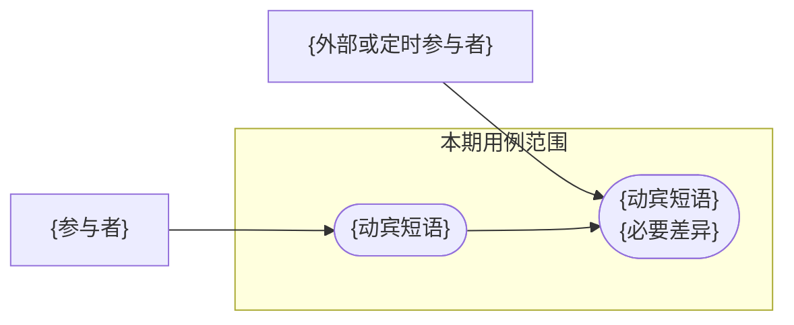

# 需求文档模板

按以下结构创建需求文档。章节用于建立清楚的阅读顺序，不是重复填写同一规则的清单；没有内容价值的可选小节应删除。用户或项目已有明确格式时保留既有结构。

````md
# {功能名称}：需求说明

## 1. 文档信息

| 项目 | 内容 |
| --- | --- |
| 功能名称 | {功能名称} |
| 文档状态 | {需求草稿 / 需求确认稿} |
| 整理日期 | {YYYY-MM-DD} |
| 原始诉求 | {用一句话说明问题和期望结果} |

## 2. 需求概述

用 2—4 个短段落说明业务问题、参与者、目标结果、核心能力和最重要的边界。先给结论，不写调查过程、接口或数据库方案。

## 3. 相关用例图

默认使用一张简洁 Mermaid `flowchart` 总览已确认的核心业务用例：



参与者不超过 4 个、核心用例不超过 8 个。节点只写一个业务目标，最多两行；不画仓库、接口、数据库、DTO、内部服务、完整流程或待定行为。确实没有有意义的参与者交互时省略本节，并在交付说明中说明原因。

## 4. 需求范围

### 4.1 业务场景范围

使用对比表或短列表说明本期覆盖的业务场景和能力边界。这里只回答“哪些场景在范围内”，不展开详细交互规则。

| 能力或场景 | {场景 A} | {场景 B} |
| --- | --- | --- |
| {能力} | {支持方式} | {支持方式或不支持} |

### 4.2 工程范围

仅在需求涉及明确终端、应用、仓库、配置或数据持久化时保留。说明各范围承担的需求职责，不写接口、表结构和实现步骤。

| 范围 | 需求职责 |
| --- | --- |
| `{application-or-repository}` | {本需求中的责任} |

### 4.3 非本期范围

- {明确不做的能力或终端}。
- {应留给技术设计或后续版本的内容}。

## 5. 功能需求

按主题使用稳定编号。每项说明用户可见行为、触发条件和结果；时间、状态、权限、数量与统计口径集中到下一节。

| 主题 | 编号 | 需求 |
| --- | --- | --- |
| {主题} | `{PREFIX-01}` | {单一、明确、可验证的功能需求} |

## 6. 业务规则与约束

集中说明跨功能或容易产生歧义的边界。只保留与本需求有关的主题，不为模板填充空规则。

| 主题 | 规则 |
| --- | --- |
| {状态 / 时间 / 权限 / 数量 / 通知 / 统计 / 兼容} | {唯一且明确的业务口径} |

## 7. 验收标准

按用户可观察场景组织，引用功能需求编号，不逐字复制需求。每项写明输入或前置条件、操作和预期结果。

| 场景 | 覆盖需求 | 验收结果 |
| --- | --- | --- |
| {场景} | `{PREFIX-01}` | {可观察、可判定的结果} |

## 8. 待定内容

仅存在未决业务问题时保留。存在本节时，文档状态必须为“需求草稿”。

| 编号 | 待定问题 | 已确认边界 | 影响范围 | 推荐方案 |
| --- | --- | --- | --- | --- |
| `OPEN-01` | {只问一个决策} | {不受该问题影响的已确认事实} | {需求编号或章节} | {推荐但未确认的方案} |

正式章节只写已确认内容；需要关联时只引用 `OPEN-01`。问题解决后将结论移入唯一归属章节，同步验收标准并删除该行。没有剩余待定项时删除本节，后续章节重新连续编号。

## 9. 现状与参考资料

### 9.1 当前行为摘要

- {经源码、配置、测试或现状文档验证的当前行为}。
- {当前限制、数据口径或失败边界}。

不要把目标需求写成当前事实。详细流程已有独立文档时只保留摘要和链接。

### 9.2 来源

- {用户确认、原型、issue 或会议结论，以及它支持的目标需求}。
- [{现状文档或源码入口}]({relative/path})：{它支持的当前行为或关键判断}。
````

## 编号规则

- 没有待定内容时删除第 8 节，“现状与参考资料”改为第 8 节。
- 用户指定或项目已有编号规则时沿用；否则按业务主题使用 3—4 位大写前缀加两位序号。
- 更新现有文档时保留仍然有效的需求编号，不因重新排序而重编号。
- 删除需求后不复用旧编号；新增需求接续同主题最大序号。

## 成稿整理

1. 只看一级标题，确认能按“概述 → 用例 → 范围 → 需求 → 规则 → 验收 → 待定 → 依据”理解文档。
2. 将每条规则放到唯一归属章节，删除 `Confirmed Decisions` 和同义重复。
3. 用功能需求编号建立验收追踪，不在验收标准里重抄整条需求。
4. 确认用例图只总览已确认业务用例，并与范围、功能需求和验收一致。
5. 确认当前行为、目标需求、推荐方案和待定问题没有混写。
